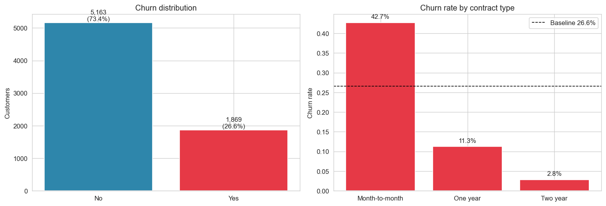
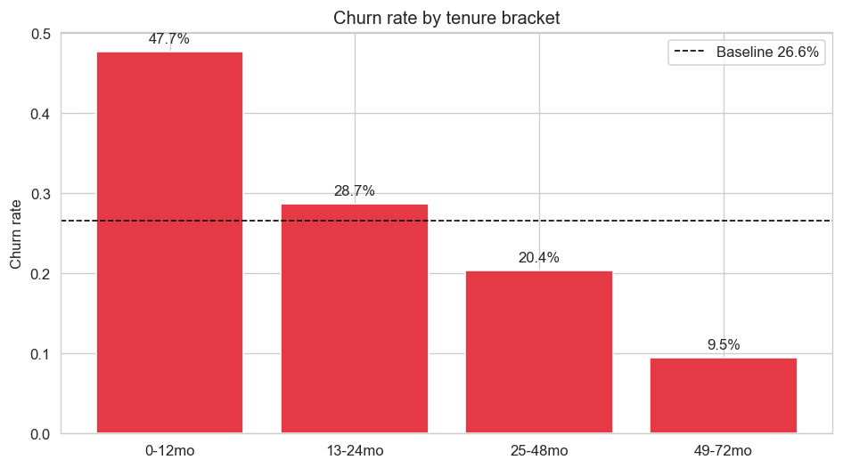
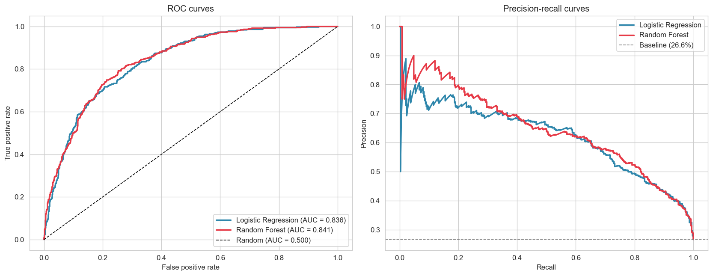
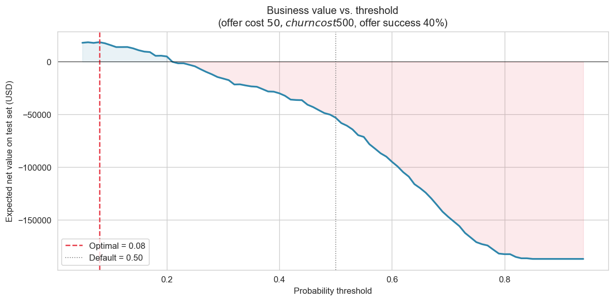
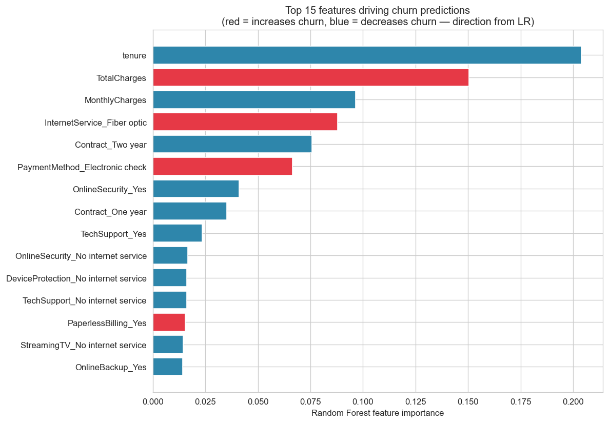
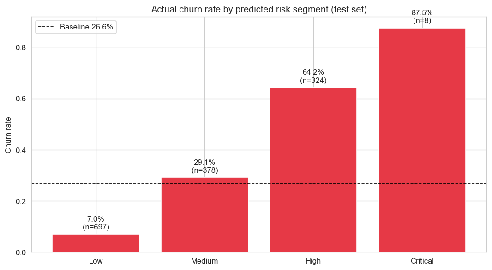

# Customer Churn Risk Analysis

> **Business question:** Which customers are most likely to churn, and what should the company do about it?

## TL;DR

A logistic regression on the IBM Telco Customer Churn dataset (~7,000 customers) reaches an **AUC of 0.836**, close to the random forest's 0.841 while being easier to explain. With a simple retention-cost setup - \$50 to make an offer, \$500 average lost CLV per churn, and a 40% offer success rate - the **default 0.5 prediction threshold loses money**. The best threshold in this setup is much lower, around **0.08**, where recall jumps to 96% at the cost of precision.

The model also points to one segment I would hand to a retention team first: **month-to-month customers paying over \$83/month with under a year of tenure churn at 75% versus a 24% baseline**. That is only 5% of the customer base, but it produces 14% of all churn.

## Visuals













## Dataset

- **Source:** [IBM Telco Customer Churn](https://www.kaggle.com/datasets/blastchar/telco-customer-churn)
- **Size:** 7,043 rows (7,032 after dropping 11 brand-new customers with no tenure history)
- **Target:** `Churn` (Yes / No), 26.6% baseline rate
- **Features:** 19 customer attributes, including contract type, tenure, monthly/total charges, internet service type, payment method, demographic flags, and add-on service flags

## Approach

- Cleaned `TotalCharges`, which loads as text because 11 tenure-zero customers have blank values.
- Used an 80/20 stratified train-test split.
- Trained logistic regression and random forest models.
- Compared AUC, precision, recall, F1, ROC curves, and precision-recall curves.
- Built a retention-cost threshold sweep instead of accepting the default 0.5 cutoff.
- Turned predicted probabilities into risk bands and a plain-English retention segment.

## Key Findings

- **Logistic regression is the model I would use here.** The random forest has a slightly higher AUC, 0.841 vs. 0.836, but LR has higher recall and F1 at the default threshold and is easier to explain. I do not see enough lift from the forest to justify making the story harder.
- **Contract type is the biggest signal.** Month-to-month customers churn at 42.7%; two-year contract customers churn at 2.8%. That is about a 15x gap, and it is bigger than anything the model adds on top.
- **Tenure matters almost as much.** First-year customers churn at 47.7%; year-four customers churn at 9.5%. Retention spend should be front-loaded.
- **The default 0.5 threshold loses money on this customer base.** With \$50 offers and \$500 churn cost, the dollar-optimal threshold is around 0.08. The model has to flag aggressively because missing a churner is 10x more expensive than a wasted offer.
- **Headline segment for the retention team:** month-to-month + monthly charges >= \$83 + tenure < 12 months. **355 customers (5% of base), 75.2% churn rate, 14.3% of all churn.**
- **Fiber-optic internet is a churn signal, not a stickiness signal.** Fiber customers pay more *and* churn more. The model cannot tell me why, but this is the part I would investigate before assuming the product is working well.

## Recommendations

1. Run the model monthly with the threshold set by actual retention economics, not 0.5. The threshold sweep in notebook 03 is the piece I would share with finance.
2. Target the headline segment with retention offers before any broad discounting. This is where the risk is concentrated enough to act on.
3. Push month-to-month customers toward annual contracts. Even modest conversion could move the overall churn number more than another round of model tuning.
4. Look into the fiber-optic customer experience. Premium-priced service should not have above-average churn.

## Limitations

- This is a public dataset, not a live customer base. The cost numbers in notebook 03 are examples and would need to be replaced with real finance inputs.
- There is no price or promotion history. I can see *that* fiber customers churn more, but not whether price, service issues, or competitor offers are driving it.
- The data is a cross-sectional snapshot. A production version would refresh predictions as customer behavior changes.
- Churn is binary in the dataset. Some customers might downgrade rather than leave, and the model cannot separate those cases.

## Reproducibility

```bash
# Clone the repo
git clone https://github.com/FaisalAlsurayhi/customer-churn-risk-analysis.git
cd customer-churn-risk-analysis

# Create virtual environment
python -m venv venv
venv\Scripts\activate         # Windows
# source venv/bin/activate    # Mac/Linux

# Install dependencies
pip install -r requirements.txt

# Dataset is included in data/telco_churn.csv
# Run notebooks in order: 01 -> 02 -> 03 -> 04
python notebooks/01_eda.py
python notebooks/02_modeling.py
python notebooks/03_threshold_business_cost.py
python notebooks/04_segments_and_recommendations.py
```

The `.py` files use jupyter percent format (`# %%` cells), so they can be opened as notebook-style scripts in VS Code.

---

*Built by Faisal Alsurayhi as part of a data analyst portfolio.*
